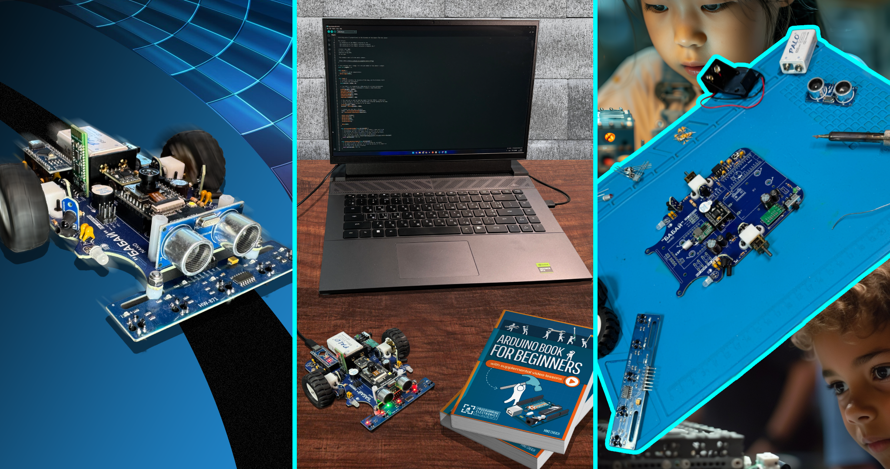

ByByte Documentation
====================

**Open-source robotics, electronics, and STEM education.**

Welcome to the official **ByByte.DIY documentation**.

ByByte.DIY is an open-source educational ecosystem built around a simple idea:
the best way to understand technology is to build it yourself.

Here you can explore our robotics platforms, learn how the hardware works,
assemble your own devices, program them, experiment with electronics, and
use the same materials for self-learning, STEM education, or robotics classes.

.. note::
   🚧 **The project is under active development.**

   Some sections of the documentation are still being written and may change
   as the hardware, software, and educational materials evolve.

Start Exploring
^^^^^^^^^^^^^^^

New to the project? Start with the introduction to understand what ByByte.DIY
is and how the ecosystem is organized.

Already building a robot? Go directly to the platform documentation for
specifications, components, assembly instructions, and troubleshooting.

Looking for the project principles, contribution guidelines, or development
history? See the additional information section.

Home
""""

.. toctree::
   :maxdepth: 2

   home/about
   home/mission
   home/quick-start
   home/organization-documents

Platforms
"""""""""

ByByte.DIY platforms are designed as practical learning tools rather than
finished consumer products. Each platform provides a foundation for exploring
electronics, programming, robotics, and engineering through real hardware.

ByByte Nano
^^^^^^^^^^^

**ByByte Nano** is a compact Arduino Nano–based educational robot designed
for learning robotics from the ground up.

Build the robot yourself, understand its electronic systems, program its
behavior, work with sensors and motors, and gradually move toward more advanced
topics such as autonomous navigation and computer vision.

.. toctree::
   :maxdepth: 2

   ByByte Nano <platforms/bybyte-nano>

.. admonition:: 🔧 More platforms are coming
   :class: note

   **TODO:** Add a short overview of future ByByte.DIY platforms here.

Additional Information
^^^^^^^^^^^^^^^^^^^^^^

The project is continuously evolving. Use these sections to follow development
and learn how to participate.

.. toctree::
   :maxdepth: 2

   changelog
   contributing

Why ByByte.DIY?
^^^^^^^^^^^^^^^

ByByte.DIY is built around openness, practical learning, and experimentation.

**🔓 Open by design**
Hardware designs, software, documentation, and educational materials are
created to be studied, modified, and improved.

**🛠 Learn by building**
Instead of treating hardware as a black box, learners assemble devices,
explore how individual components work, and solve real technical problems.

**📚 Built for education**
The ecosystem is intended for independent learners, teachers, robotics
clubs, makerspaces, and anyone interested in practical STEM education.

**🌱 Designed to grow**
Start with basic electronics and programming, then progress toward robotics,
embedded systems, wireless communication, computer vision, and more.

Community
^^^^^^^^^

ByByte.DIY grows through people who build, learn, teach, experiment, and share.

You can contribute by improving hardware, developing software, creating educational materials, 
reporting issues, improving documentation, or simply building something new with the platform.

.. admonition:: 🌍 Community links
   :class: note

   `**Discord** <https://discord.gg/t5wnTq3C'>`_ channel for real-time discussion, questions, and support.

   `**Telegram** <https://t.me/bybytediy'>`_ channel for project updates and community announcements.

What's Next?
^^^^^^^^^^^^

.. admonition:: 🚀 Project updates
   :class: note

   **TODO:** Add current development highlights, recently released platforms, featured lessons, or important project announcements.

______

**Build it. Understand it. Improve it. Share it.**