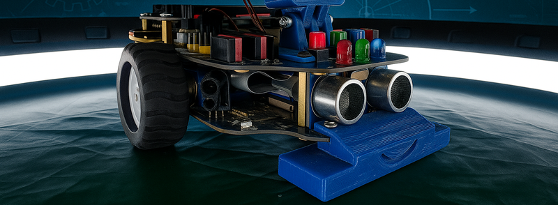

ByByte Mega
===========

Advanced robotics platform for schools and robotics clubs.

.. toctree::
   :maxdepth: 2
   :caption: Overview:

   mega/index

.. toctree::
   :maxdepth: 2
   :caption: Specification:

   mega/spec

.. toctree::
   :maxdepth: 2
   :caption: Build & Schematics

   mega/build

.. toctree::
   :maxdepth: 2
   :caption: Programming:

   mega/programming

.. toctree::
   :maxdepth: 2
   :caption: FAQ:

   mega/faq

Troubleshooting
~~~~~~~~~~~~~~~

**Power Issues:**

* Check power switcher is in ON position
* Check battery voltage (should be >3.5V and <4.2V)
* Verify battery holder connections
* Check for shorts
* Probe power after MOSFETs

**Sensor Problems:**

* Check wire connections to sensors
* Test sensors individually (use test code from examples)
* Check components are connected correctly

**Motor Issues:**

* Verify motor driver wiring
* Test motor power supply
* Use test code from examples to check motor operation
* If motors rotates in wrong direction, check polarity of motors

**Bluetooth Communication Failures:**

* Check baud rate settings (9600)
* Check if Bluetooth module is powered and led is blinking
* Test with simple sketch (use test code from examples)
* Check for interference with other devices

Support & Resources
~~~~~~~~~~~~~~~~~~~

**Advanced Support:**

* Technical documentation
* Competition guides
* Video tutorials
* Expert community

**Resources:**

* PCB design files (KiCad/Gerber)
* 3D models (STL/STEP)
* Example code library
* Competition strategies

---

**Ready for advanced robotics?** Start building your Mega platform!

:doc:`Back to Platforms <../platforms>` | :doc:`See ByByte nano <nano>`
