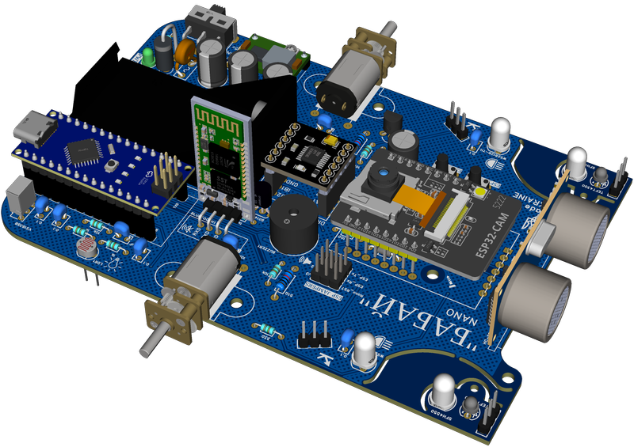

ByByte nano
===========

Simple robotics platform for beginners and home learning.

.. toctree::
   :maxdepth: 2
   :caption: Overview:

   nano/index

.. toctree::
   :maxdepth: 2
   :caption: Specification:

   nano/spec

.. toctree::
   :maxdepth: 2
   :caption: Build & Schematics

   nano/build

.. toctree::
   :maxdepth: 2
   :caption: Programming:

   nano/programming
   
.. toctree::
   :maxdepth: 2
   :caption: FAQ:

   nano/faq

Troubleshooting
~~~~~~~~~~~~~~~

**Robot doesn't move:**

1. Check battery voltage
2. Verify motor connections
3. Test motors separately
4. Check motor driver

**Sensors not working:**

1. Verify wiring
2. Test with simple sketch
3. Check power supply
4. Ensure sensors face correctly

**Erratic behavior:**

1. Check for loose wires
2. Verify power is adequate
3. Calibrate sensors
4. Review code logic

**USB not recognized:**

1. Install CH340 drivers (if using clone)
2. Try different USB cable
3. Check USB port
4. Restart IDE

Support & Resources
~~~~~~~~~~~~~~~~~~~

**Need Help?**

* Check our GitHub discussions
* Post in community forum
* Contact via email
* Join our Discord/Telegram

**Additional Resources:**

* Video tutorials (coming soon)
* Lesson plans
* Code library
* 3D printable parts

---

**Ready to build?** Get your components and start assembling!

:doc:`Back to Platforms <../platforms>` | :doc:`See ByByte Mega <mega>`
